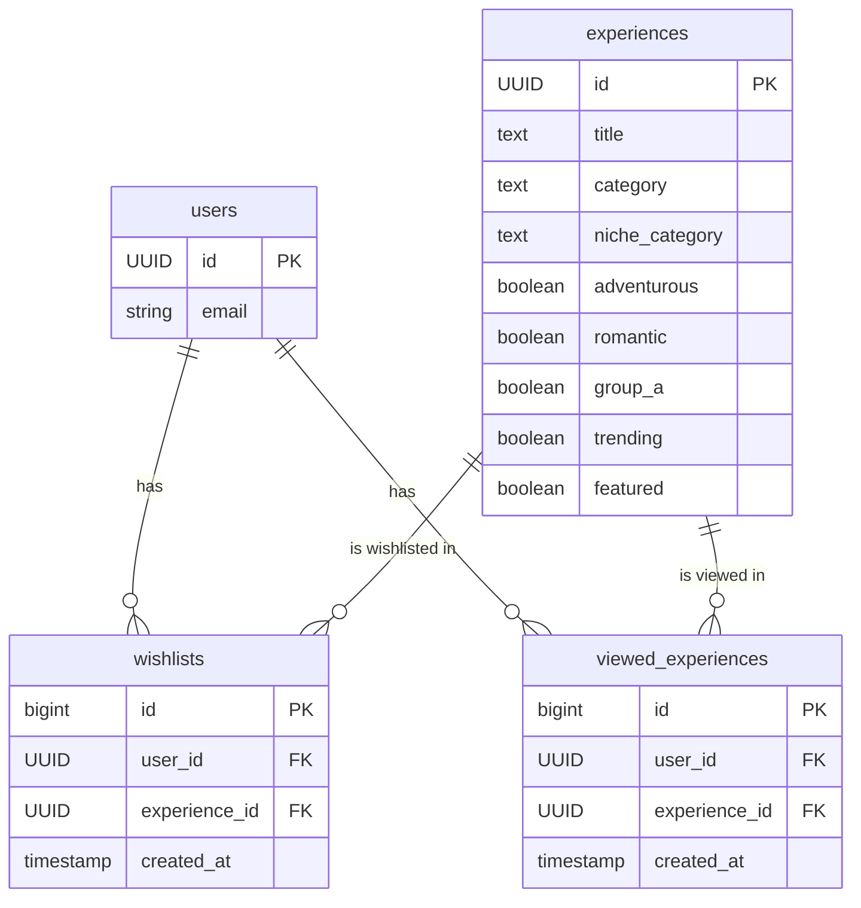

# Project Documentation: Experience Recommendations API

## 1. Overview

### 1.1. Project Purpose and Features

This project is a **personalized experience recommendation engine**. It is designed to function as a backend service for a front-end application where users can discover and save unique experiences (e.g., gift ideas, activities, travel destinations).

The core purpose is to move beyond simple keyword-based searches and provide users with intelligent, context-aware suggestions that align with their implicit and explicit preferences.

**Key Features:**

- **User Preference Tracking:** The system tracks which experiences a user has "wishlisted" (liked) and which they have simply viewed.
- **Semantic Tag-Based Recommendations:** It analyzes the tags associated with a user's saved experiences (e.g., "adventurous," "romantic," "outdoor") to understand their tastes.
- **LLM-Powered Tag Expansion:** A Large Language Model (Groq with Llama3) is used to find semantically similar tags. For example, if a user likes "adventure," the system might infer they are also interested in "outdoor," "sports," and "adrenaline."
- **Personalized Ranking:** The LLM is also used to rank a list of candidate experiences based on how well they align with the user's inferred preferences.
- **Cold Start Handling:** For new users with no interaction history, the system provides a list of random "trending" or "featured" experiences to get them started.
- **Exclusion of Seen Content:** The API ensures that users are not recommended experiences they have already wishlisted or viewed.
- **RESTful API:** All functionality is exposed via a clean, simple-to-use FastAPI server.

### 1.2. Real-World Context

This service is designed to be the "brains" behind a "Tinder for experiences" style application. A user would be presented with experience cards, and they can swipe right to wishlist or swipe left to dismiss.

- **Frontend Interaction:** A mobile or web app would call the `/suggested` endpoint to fetch a batch of recommendations to display to the user.
- **User Onboarding:** A new user would initially see generic popular experiences. As they interact with the app, the recommendations become progressively more tailored to their tastes.
- **Business Goal:** Increase user engagement and conversion by providing highly relevant and delightful content, making it easier for users to find and purchase experience gifts or activities.

### 1.3. Tools and Libraries

- **Backend Framework:** **FastAPI** - For building the asynchronous, high-performance API.
- **LLM Provider:** **Groq** - Provides access to the Llama3-8b-8192 model for fast and efficient natural language processing tasks (tag similarity and ranking).
- **Database:** **Supabase** (PostgreSQL) - Used as the primary data store for:
  - `experiences`: A catalog of all available experiences.
  - `wishlists`: Tracks which users have liked which experiences.
  - `viewed_experiences`: Tracks all experiences a user has been shown.
- **Vector Database:** While not explicitly in the current code, the documentation mentions **Qdrant** in the prompt, suggesting a future or intended use for vector-based similarity search. The current implementation uses LLM-based semantic search.
- **Python Libraries:**
  - `requests`: For making HTTP requests to the Groq API.
  - `python-dotenv`: To manage environment variables.
  - `uvicorn`: As the ASGI server to run the FastAPI application.
  - `langchain`: Provides the `GroqLLM` wrapper for easier integration.

## 2. Codebase Structure

### 2.1. Directory and File Roles

```
/
├── .gitignore
├── api_server.py         # Main entry point for the FastAPI application. Defines API endpoints.
├── main.py               # Core application logic for generating recommendations.
├── perplexity_llm.py     # LangChain wrapper for the Groq LLM.
├── tools.py              # Helper function to query the Groq API.
├── requirements.txt      # Lists all Python dependencies for the project.
├── render.yaml           # Deployment configuration for the Render platform.
├── LICENSE
├── README.md
└── DOCUMENTATION.md      # This file.
```

### 2.2. File Breakdown and Connections

- **`api_server.py`**:

  - **Role:** The web-facing component. It receives HTTP requests, validates inputs, and routes them to the appropriate logic.
  - **Connections:** It imports `get_suggested_experiences` from `main.py` to do the actual work. It is the orchestrator of the user request.

- **`main.py`**:

  - **Role:** The "service layer" or "business logic" layer. It contains the primary function `get_suggested_experiences` which encapsulates the entire recommendation workflow.
  - **Connections:**
    - It connects to **Supabase** to fetch user history and experience data.
    - It calls `query_groq` from `tools.py` (indirectly via `get_similar_tags_with_llm` and the ranking prompt) to interact with the **Groq LLM**.
    - It uses environment variables loaded by `dotenv` to get credentials for Supabase and Groq.

- **`perplexity_llm.py`**:

  - **Role:** Defines a custom LangChain `LLM` class named `GroqLLM`. This abstracts the `query_groq` call into a standard interface that LangChain tools can use.
  - **Connections:** It imports `query_groq` from `tools.py`.

- **`tools.py`**:
  - **Role:** A utility module containing the `query_groq` function.
  - **Connections:** This is the only module that directly makes an HTTP `POST` request to the Groq API endpoint. It handles authentication and payload construction.

### 2.3. Startup Flow

1.  The application is started by running `uvicorn api_server:app`.
2.  Uvicorn loads `api_server.py`.
3.  FastAPI initializes, creating the `app` instance.
4.  The CORS middleware is added to the FastAPI application to allow cross-origin requests.
5.  The API endpoints (`/`, `/suggested`, `/health`) are defined and registered with FastAPI.
6.  At this point, the server is running and ready to accept incoming requests. No connections to Supabase or Groq are made until a request hits the `/suggested` endpoint.

## 3. Full Workflow Documentation

### 3.1. API Endpoint: `GET /suggested`

This is the primary endpoint of the service.

- **URL:** `/suggested`
- **Method:** `GET`
- **Query Parameters:**
  - `user_id` (string, required): The unique identifier for the user.
  - `k` (integer, optional, default: 5): The number of recommendations to return. Must be between 1 and 20.

#### Workflow Diagram (Mermaid)

```mermaid
sequenceDiagram
    participant Frontend
    participant API (api_server.py)
    participant Logic (main.py)
    participant Supabase
    participant Groq LLM

    Frontend->>+API: GET /suggested?user_id=...&k=...
    API->>+Logic: get_suggested_experiences(user_id, k)

    alt User has no history
        Logic->>+Supabase: Query wishlists & viewed_experiences
        Supabase-->>-Logic: Return empty lists
        Logic->>+Supabase: Query for random trending/featured experiences
        Supabase-->>-Logic: Return list of experiences
        Logic-->>-API: Return shuffled list
    else User has history
        Logic->>+Supabase: Query wishlists & viewed_experiences for user_id
        Supabase-->>-Logic: Return list of experience IDs
        Logic->>+Supabase: Query experiences table for tags of those IDs
        Supabase-->>-Logic: Return list of tags (e.g., 'adventure', 'romantic')
        Logic->>+Supabase: Query experiences table for ALL available tags
        Supabase-->>-Logic: Return set of all unique tags
        Logic->>+Groq LLM: Find similar tags based on user's tags
        Groq LLM-->>-Logic: Return expanded list of tags (e.g., 'outdoor', 'sports')
        Logic->>+Supabase: Query experiences with these similar tags (excluding seen IDs)
        Supabase-->>-Logic: Return candidate experiences
        Logic->>+Groq LLM: Rank candidates based on user's original tags
        Groq LLM-->>-Logic: Return ranked list of indices
        Logic-->>-API: Return top k ranked experiences
    end

    API-->>-Frontend: 200 OK with JSON payload
```

#### Detailed Step-by-Step Lifecycle

1.  **Request:** The frontend sends a `GET` request to `/suggested` with the `user_id`.
2.  **API Layer (`api_server.py`):**
    - The `suggested_for_you` function is invoked.
    - It extracts `user_id` and `k` from the request.
    - It calls `get_suggested_experiences(user_id, k)` from `main.py` inside a `try...except` block to handle potential errors.
3.  **Logic Layer (`main.py` - `get_suggested_experiences`):**
    - **Step 1: Fetch User History:**
      - Two parallel queries are sent to Supabase:
        1.  `SELECT experience_id FROM wishlists WHERE user_id = ...`
        2.  `SELECT experience_id FROM viewed_experiences WHERE user_id = ...`
      - The results are combined into a single set of `all_seen_ids`.
    - **Step 2: Handle Cold Start:**
      - If `all_seen_ids` is empty, the function queries Supabase for `k` experiences that are marked as `trending` or `featured`.
      - These are shuffled and returned immediately. The workflow stops here for new users.
    - **Step 3: Gather User's Preferred Tags:**
      - A query is made to the `experiences` table to fetch the full records for the `all_seen_ids`.
      - The code iterates through these records and extracts tags from the `category`, `niche_category`, and boolean flag columns (`adventurous`, `romantic`, `group_a`). These are collected into a `user_tags` set.
    - **Step 4: Gather All Available Tags:**
      - Another query is sent to the `experiences` table to get all possible tags from the entire dataset. This provides the universe of tags for the LLM to choose from.
    - **Step 5: LLM-Powered Tag Expansion:**
      - The `get_similar_tags_with_llm` function is called.
      - It constructs a detailed prompt containing the `user_tags` and `available_tags`.
      - This prompt is sent to the Groq API via the `query_groq` function.
      - The LLM returns a comma-separated string of the most semantically similar tags. These are parsed into a list called `similar_tags`.
    - **Step 6: Find Candidate Experiences:**
      - A complex `OR` filter is constructed based on the `similar_tags`.
      - A query is sent to Supabase to find all experiences that match any of these tags.
      - The code then filters out any experiences the user has already seen (`all_seen_ids`). The result is a list of `candidates`.
    - **Step 7: LLM-Powered Ranking:**
      - If there are candidates, a new prompt is constructed. This prompt includes the user's original `user_tags` and a numbered list of the candidate experiences.
      - The prompt asks the LLM to return the _indices_ of the top `k` most relevant experiences.
      - The LLM's response (e.g., "3, 1, 5") is parsed to re-order the `candidates` list.
      - If the LLM call fails, the candidates are simply shuffled as a fallback.
    - **Step 8: Return Results:** The final, ranked list of the top `k` experiences is returned.
4.  **Response (`api_server.py`):**
    - The returned list is wrapped in a JSON object with a `status` field.
    - The final JSON is sent back to the frontend with a `200 OK` status code.

## 4. Function-Level Details

### `api_server.py`

- **`root()`**
  - **Description:** A simple root endpoint to confirm the API is running and provide basic information.
  - **Arguments:** None.
  - **Returns:** A dictionary with a welcome message and a list of available endpoints.
- **`suggested_for_you(user_id: str, k: int)`**
  - **Description:** The main API endpoint for fetching recommendations.
  - **Arguments:**
    - `user_id` (str): The user's UUID.
    - `k` (int): Number of recommendations to fetch.
  - **Returns:** A dictionary containing the status and a list of recommended experience objects.
  - **Side Effects:** None directly, but triggers database reads in `main.py`.
- **`health_check()`**
  - **Description:** A standard health check endpoint for monitoring services.
  - **Arguments:** None.
  - **Returns:** `{"status": "healthy", "service": "experience-recommendations"}`.

### `main.py`

- **`query_groq(messages, model)`**
  - **Description:** A wrapper function to make calls to the Groq API. It is duplicated in `tools.py`; this version is specific to `main.py`.
  - **Arguments:**
    - `messages` (list): A list of message dictionaries for the chat completion.
    - `model` (str): The model to use (e.g., "llama3-8b-8192").
  - **Returns:** The string content of the LLM's response.
  - **Side Effects:** Makes an external HTTP request.
- **`get_similar_tags_with_llm(user_tags, available_tags, k)`**
  - **Description:** Uses the LLM to find tags that are semantically similar to the user's preferred tags.
  - **Arguments:**
    - `user_tags` (list): A list of tags the user has shown interest in.
    - `available_tags` (list): A list of all possible tags in the system.
    - `k` (int): The maximum number of similar tags to return.
  - **Returns:** A list of strings, where each string is a similar tag.
- **`get_suggested_experiences(user_id, k)`**
  - **Description:** The main logic function that orchestrates the entire recommendation process.
  - **Arguments:**
    - `user_id` (str): The user's UUID.
    - `k` (int): The number of recommendations to generate.
  - **Returns:** A list of experience dictionaries.
  - **Side Effects:** Performs multiple read queries against the Supabase database and makes two separate calls to the Groq LLM.

### `perplexity_llm.py`

- **`GroqLLM` (class)**
  - **Description:** A custom LangChain LLM wrapper for Groq.
  - **`_call(prompt, stop)`:** The method LangChain invokes. It calls `query_groq`.
  - **`_llm_type`:** A property that identifies the LLM type as "groq".

### `tools.py`

- **`query_groq(messages, model)`**
  - **Description:** The primary, reusable function for querying the Groq API. It handles adding the system prompt, setting headers, and making the request.
  - **Arguments:**
    - `messages` (list): The list of user/assistant messages.
    - `model` (str): The Groq model to use.
  - **Returns:** The string content from the LLM's response.
  - **Raises:** An `Exception` if the API call fails.

## 5. Database Modeling

### 5.1. Tables and Schema

- **`experiences`**

  - **Purpose:** The master catalog of all experiences.
  - **Fields:**
    - `id` (UUID, Primary Key): Unique identifier for the experience.
    - `title` (text): The display title of the experience.
    - `category` (text): Broad category (e.g., "Food & Drink", "Adventure").
    - `niche_category` (text): More specific sub-category (e.g., "Wine Tasting", "Rock Climbing").
    - `adventurous` (boolean): Flag for adventurous experiences.
    - `romantic` (boolean): Flag for romantic experiences.
    - `group_a` (boolean): Flag for group activities.
    - `trending` (boolean): Flag for currently trending experiences.
    - `featured` (boolean): Flag for featured experiences.
    - `...` (other fields like `description`, `price`, `location`, etc.)

- **`wishlists`**

  - **Purpose:** A join table to track which users have "liked" or "wishlisted" which experiences.
  - **Fields:**
    - `id` (bigint, Primary Key): Unique row ID.
    - `user_id` (UUID, Foreign Key -> `auth.users.id`): The user who liked the experience.
    - `experience_id` (UUID, Foreign Key -> `experiences.id`): The experience that was liked.
    - `created_at` (timestamp): When the user liked the experience.

- **`viewed_experiences`**
  - **Purpose:** A join table to log every experience a user has been shown in their recommendation feed. This is crucial for preventing duplicate recommendations.
  - **Fields:**
    - `id` (bigint, Primary Key): Unique row ID.
    - `user_id` (UUID, Foreign Key -> `auth.users.id`): The user who viewed the experience.
    - `experience_id` (UUID, Foreign Key -> `experiences.id`): The experience that was viewed.
    - `created_at` (timestamp): When the experience was viewed.

### 5.2. Entity-Relationship Diagram (Mermaid)



## 6. Vector Search Logic (LLM-based)

The current implementation does **not** use a vector database like Qdrant. Instead, it achieves a similar outcome using a two-step LLM process:

1.  **Semantic Tag Search:**

    - **Vector Creation (Implicit):** Instead of creating explicit embedding vectors, the system uses the user's interaction history (`wishlists`, `viewed_experiences`) to build a "profile" of preferred tags (e.g., `{'adventure', 'outdoor', 'group_a'}`).
    - **Similarity Search (LLM Prompt):** This tag profile is fed to the Llama3 model. The model is prompted to act as a search engine, returning other tags from the master list (`available_tags`) that are semantically related. This offloads the "similarity" calculation to the LLM's internal understanding of language.
    - **Example:** If the user likes "romantic" and "dining," the LLM might return "wellness," "luxury," and "couples massage" as similar tags.

2.  **Relevance Ranking:**
    - **Candidate Filtering:** The system first retrieves all experiences that match the expanded set of similar tags using standard SQL `OR` filters.
    - **Ranking (LLM Prompt):** This smaller list of candidates is then presented to the LLM again. This time, the prompt asks the LLM to _rank_ the candidates based on the user's _original_ tags. This acts as a re-ranking step, ensuring the final recommendations are closely aligned with the user's core preferences.

This approach is a clever way to leverage the power of LLMs for recommendation without the overhead of managing a separate vector database infrastructure.

## 7. Tech Stack and Setup

### 7.1. Required Versions

- **Python:** 3.8+
- **FastAPI:** See `requirements.txt` for the exact version.
- **Supabase Python Client:** See `requirements.txt`.
- **LangChain:** See `requirements.txt`.
- **Groq:** No client library, uses `requests`.

### 7.2. Setup and Installation

1.  **Clone the repository.**
2.  **Create a virtual environment:**
    ```bash
    python -m venv venv
    source venv/bin/activate
    ```
3.  **Install dependencies:**
    ```bash
    pip install -r requirements.txt
    ```
4.  **Create a `.env` file:**
    - Copy the contents of `.env.example` (if it exists) or create a new file.
    - Populate the following variables:
      ```
      SUPABASE_URL="your_supabase_project_url"
      SUPABASE_SERVICE_ROLE_KEY="your_supabase_service_key"
      GROQ_API_KEY="your_groq_api_key"
      ```
5.  **Run the application:**
    ```bash
    uvicorn api_server:app --host 0.0.0.0 --port 8000 --reload
    ```

### 7.3. Error Handling

- **API Layer:** The main `suggested_for_you` endpoint in `api_server.py` has a top-level `try...except Exception as e` block. If any error occurs during the recommendation process (database error, LLM API failure, etc.), it catches the exception and returns a JSON response with `status: "error"` and the error message.
- **Groq API:** The `query_groq` function checks the HTTP status code of the response. If it's not `200`, it raises an `Exception` with the status code and error text from the API, which is then caught by the main error handler.
- **LLM Fallbacks:** The recommendation logic includes fallbacks if the LLM calls fail:
  - If tag similarity analysis fails, it defaults to using the user's exact tags.
  - If the final ranking call fails, it shuffles the candidate list randomly.
